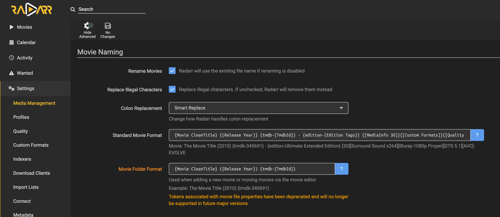
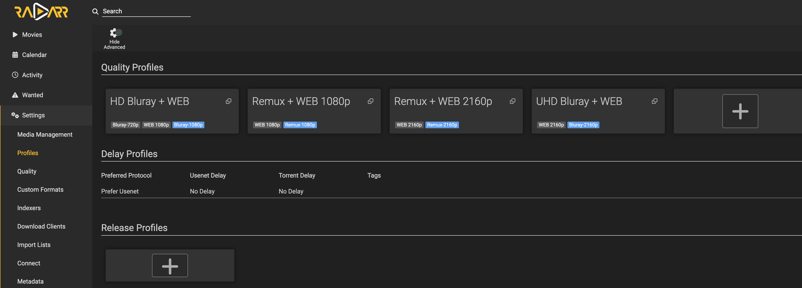
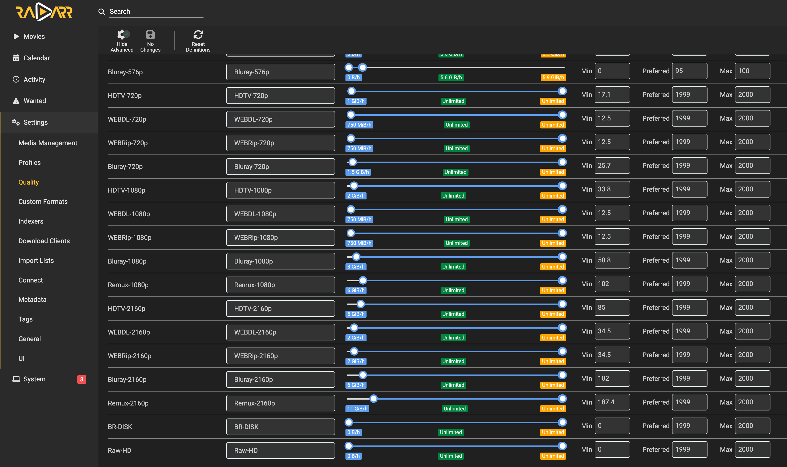
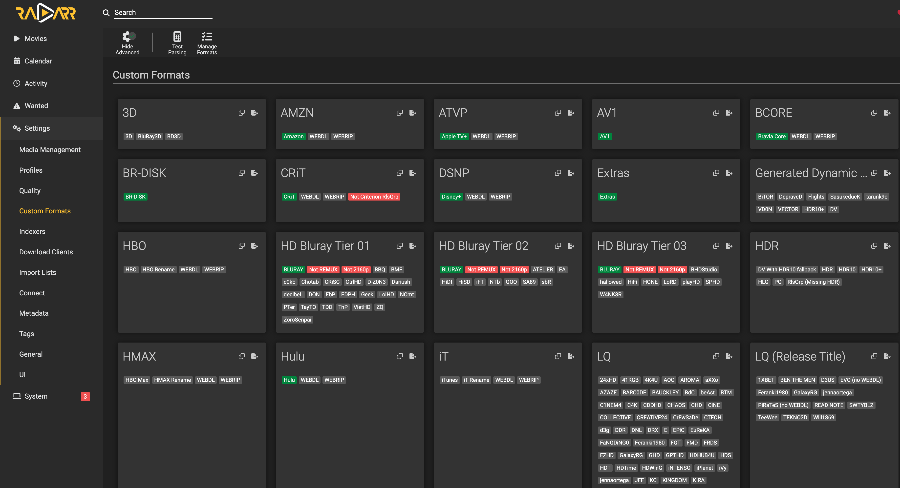

# Recyclarr
This is used to sync Media Naming, Quality Definitions (File Size), Custom Formats and Quality Profiles from TRaSH Guides to Radarr and Sonarr automatically on a schedule.
This guide shows how to setup Recyclarr for Radarr only. Setting up for Sonarr is similar.

- Some people run 3 instances of Radarr for different quality profiles (e.g., 1080p, 4K, Anime). 
- But I like to keep it simple and just run 1 instance of Radarr with 1080p and 4K profiles combined.
- I don't watch Anime, so I don't need a separate Radarr instance for that. If I were to watch Anime movies, I would just add another instance of Radarr and use Recyclarr to sync the Anime profiles there.

Check out their [docs](https://recyclarr.dev/guide/features) for more info.

## Steps
1. Make sure you have Radarr running. If not, follow the [Radarr setup guide](../radarr/README.md).
2. Add recyclaar to the list in main `.env` file
   ```env
   COMPOSE_PROFILES="required,...,recyclaar"
   ```
3. Open `recyclaar/secrets.yml` file and set the following:
    - `radarr_main_api_key`: Get it from Radarr > Settings > General > Security > API Key
4. Give ownership of recyclarr data folder to your user
   ```bash
   $ sudo chown -R $(id -u):$(id -g) -R /opt/docker/data/recyclarr
   ```
5. Populate the `recyclarr.yml` file.
   - Most people get scared of apps with no UI, but it's really simple. 
   - Just grab all the TRaSH quality profiles and custom formats, and quality definition from their [`config-templates` repo's `includes` folder](https://github.com/recyclarr/config-templates/tree/master/radarr/includes).
     - These are all the TRaSH quality profiles for 1080 and 4K: https://trash-guides.info/Radarr/radarr-setup-quality-profiles/#trash-quality-profiles
   - For visual, this is how their folders look like. This gives you a complete picture of what `include`s you need.
     ```
     radarr
     ├── includes
     │   ├── custom-formats
     │   │   ├── sqp
     │   │   │   └── ...
     │   │   ├── radarr-custom-formats-anime.yml
     │   │   ├── radarr-custom-formats-hd-bluray-web.yml
     │   │   ├── radarr-custom-formats-remux-web-1080p.yml
     │   │   ├── radarr-custom-formats-remux-web-2160p.yml
     │   │   └── radarr-custom-formats-uhd-bluray-web.yml
     │   │
     │   ├── quality-definitions
     │   │   ├── sqp
     │   │   │   └── ...
     │   │   ├── radarr-quality-definition-anime.yml
     │   │   └── radarr-quality-definition-movie.yml
     │   │
     │   └── quality-profiles
     │       ├── sqp
     │       │   └── ...
     │       ├── radarr-quality-profile-anime.yml
     │       ├── radarr-quality-profile-hd-bluray-web.yml
     │       ├── radarr-quality-profile-remux-web-1080p.yml
     │       ├── radarr-quality-profile-remux-web-2160p.yml
     │       └── radarr-quality-profile-uhd-bluray-web.yml
     │
     ├── templates
     │   ├── sqp
     │   │   └── ... (SQP template YAML files)
     │   ├── anime-radarr.yml
     │   ├── hd-bluray-web.yml
     │   ├── remux-web-1080p.yml
     │   ├── remux-web-2160p.yml
     │   └── uhd-bluray-web.yml
     ```
   - Create an empty `.yml` file and populate the `include`s in `recyclarr.yml` like below. For the complete file, check out my [recyclarr.yml](recyclarr.yml).
     ```yml
         include:
           # Seen in Radarr > Settings > Quality
           # This can be retrieved by running `docker exec recyclarr recyclarr list qualities radarr`
           - template: radarr-quality-definition-movie
           
           # HD Bluray + WEB (1080p)
           # Seen in Radarr > Settings > Profiles
           - template: radarr-quality-profile-hd-bluray-web
           # Seen in Radarr > Settings > Custom Formats
           # This can be retrieved by running `docker exec recyclarr recyclarr list custom-formats radarr`
           - template: radarr-custom-formats-hd-bluray-web
           
           # UHD Bluray + WEB (4K)
           - template: radarr-quality-profile-uhd-bluray-web
           - template: radarr-custom-formats-uhd-bluray-web
           
           # Remux + WEB 1080p
           - template: radarr-quality-profile-remux-web-1080p
           - template: radarr-custom-formats-remux-web-1080p
           
           # Remux + WEB 2160p
           - template: radarr-quality-profile-remux-web-2160p
           - template: radarr-custom-formats-remux-web-2160p
     ```
   - Populate media naming
     ```yml
         # Seen in Radarr > Settings > Media Management > Movie Naming
         # This can be retrieved by running `docker exec recyclarr recyclarr list naming radarr`.
         # More info: https://recyclarr.dev/cli/list/
         media_naming:
           folder: plex-tmdb
           movie:
             rename: true
             standard: plex-tmdb
     ```
   - Populate update options
     ```yml
         delete_old_custom_formats: true
         replace_existing_custom_formats: true
     ```
   - That's it! You have all the recommended TRaSH configs in place.
     - If you want to customize it further, check out
       - [Quick Setup Templates](https://recyclarr.dev/guide/guide-configs)
       - [Configuration Examples](https://recyclarr.dev/reference/config-examples) - It shows different scenarios and also shows how to combine multiple configs into a single file for a single instance.
     - For 99% of users, this is more than enough.
6. Copy the config files to your server
   - This includes copying this folder except the `screenshots` folder and the `README.md` file.
7. Start Recyclaar
   ```bash
   $ docker compose up -d recyclaar
   ```
8. It runs on a schedule, but you can force it to run now
   ```bash
   $ docker exec recyclarr recyclarr sync
   ```
   You should see something like this:
   ```
   ===========================================
   Processing Radarr Server: [radarr_main]
   ===========================================
   
   [INF] Created 41 New Custom Formats
   [INF] Total of 41 custom formats were synced
   [INF] Created 4 Profiles: ["HD Bluray + WEB","UHD Bluray + WEB","Remux + WEB 1080p","Remux + WEB 2160p"]
   [INF] A total of 4 profiles were synced. 4 contain quality changes and 4 contain updated scores
   [INF] Total of 14 sizes were synced for quality definition movie
   [INF] Media naming has been updated
   [INF] Completed at 12/07/2025 00:03:44
   ```
9. Check out Radarr now. You should see all the new Quality Definitions, Quality Profiles, Custom Formats and Media Naming applied by Recyclarr! 🎉
   - Movie Naming (Settings > Media Management > Movie Naming)
     
     
   - Profiles (Settings > Profiles)
     
     
   - Quality Definitions (Settings > Quality)
     
     
   - Custom Formats (Settings > Custom Formats)
   
     
10. You're done with Recyclarr setup! It will run every day to sync any updates from TRaSH Guides automatically.
